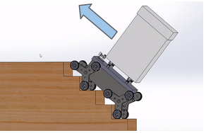

# Autonomous Stair Climber Robot

 

 As a part of the competition [Flipkart GRiD 2.0 - Robotics Challenge](https://dare2compete.com/hackathon/flipkart-grid-20-robotics-challenge-flipkart-grid-20-flipkart-113687), A novel warehouse Stair Climber Bot is developed. 

It is a fully Autonomous bot which uses complex Vision Algorithms to navigate through ground and detects Stairs without the use of side railings to climb the stairs and maintain a steady trajectory and motion.

The Repository Contains the Layouts, CAD files, Stair detection code and report of the project. 

  

## Notable Features:
* Novel Tri-Wheel Design
* Autonomously detects Stairs and Plans Path for climbing up or down the stairs  
* Fast, Robust, Maneuverable in any terrain, reliable and stable while climbing
* Autonomously detects and changes state b/w Climbing Mode and Driving Mode, independently for front and rear wheels.
* Independently looks for the next Staircase on a landing.
* Keeps payload compartment aligned horizontally always. (using linear actuators and gyro)
* Adjusts bot orientation to remain centrally aligned during Stair Climbing without use of side walls

## Report and Simulations:
* [Final Report](https://github.com/rahul0805/Stair_climber/blob/master/report/final_report.pdf)
* [Simulation Videos](https://youtube.com/playlist?list=PLahYkbmWckzONub3VNVtrBdGIVFIZ1MPK) 
